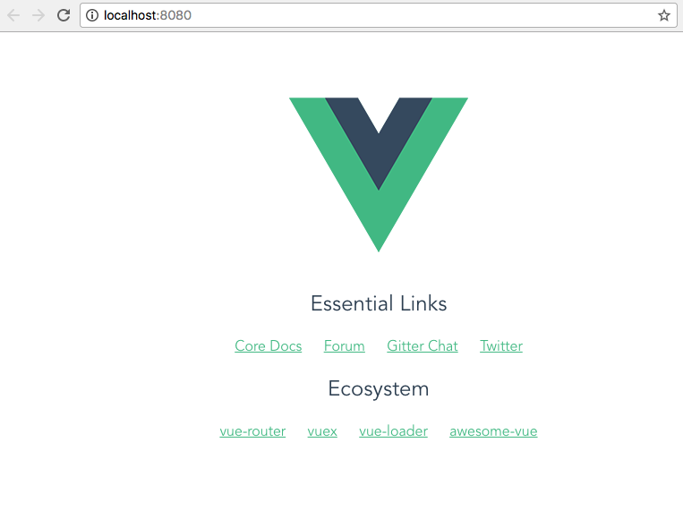

## Welcome to Vue InstantSearch

**WARNING: This project is currently in BETA.**

Vue InstantSearch is the ultimate toolbox for creating instant-search
experiences using [Vue.js](https://vuejs.org/) and [Algolia](https://www.algolia.com/).

## Setup a new Vue project

We will use the official [vue-cli](https://vuejs.org/v2/guide/installation.html#CLI) to bootstrap a new Vue project, along with the [webpack-simple template](https://github.com/vuejs/vue-cli#official-templates).

```sh
npm install --global vue-cli
vue init webpack-simple vue-instantsearch-getting-started
# Default settings are enough, hit `Enter ⏎` at every question
```

Then install the dependencies of your new project:

```sh
cd vue-instantsearch-getting-started
npm install
```

## Install `vue-instantsearch`

Add Vue InstantSearch as a dependency, it's published on [npm](https://www.npmjs.com):

```sh
npm install --save vue-instantsearch
```

## Run the development environement

When `vue-cli` bootstraped the project, it added some [npm scripts](https://docs.npmjs.com/misc/scripts) to your project, like a `dev` one. Let's use it:

```sh
npm run dev
```

This should open a new tab in your browser with this inside:

.

Leave the `dev` script running, we will update the code and it will reload your browser
automatically.

## Use the InstantSearch plugin

Now we need to tell Vue to use the Vue InstantSearch plugin so that all search
components are available in our templates.

Open the `src/main.js` entry point and replace the existing content with the following:

```js
import Vue from 'vue';
import App from './App.vue'
import InstantSearch from 'vue-instantsearch';

Vue.use(InstantSearch);

new Vue({
  el: '#app',
  render: h => h(App)
});
```

From now on, you can use all [Vue InstantSearch components](using-components.md) in your templates throughout the whole application.

## Create your first search experience

Let's bootstrap a small search interface.

Open the `src/App.vue` component. Then replace the whole beginning of the file, between the `<template></template>` tags, with the following:

```html
<template>
  <ais-index
    appId="latency"
    apiKey="3d9875e51fbd20c7754e65422f7ce5e1"
    indexName="bestbuy"
  >
    <ais-search-box />
    <ais-results>
      <template scope="{ result }">
        <h2><ais-highlight :result="result" attributeName="name" /></h2>
      </template>
    </ais-results>
  </ais-index>
</template>
```

Save, see the result in browser and play with it:

.

## How it works

In this section you will learn a bit more about what you just implemented.

### The Index component

All search components needs to be wrapped in an Index component.

```html
<ais-index
  appId="latency"
  apiKey="3d9875e51fbd20c7754e65422f7ce5e1"
  indexName="bestbuy"
>
  <!-- Search components go here -->
</ais-index>
```

You should configure the Index component with the application ID and API search only key.

The job of the Index component is to hold the state of the search, and to provide it to child components.

**Info: Alternatively you can [manually inject a search store](search-store.md), for example to support server-side rendering.**

### Algolia demo credentials

For the purpose of the demo, we provided you with some default Algolia credentials:

 - `appId`: `latency`
 - `searchKey`: `3d9875e51fbd20c7754e65422f7ce5e1`
 - `indexName`: `bestbuy`

When you will be ready to go further, you can [create your own Algolia account](https://www.algolia.com/users/sign_up) and [find your credentials](https://www.algolia.com/api-keys) in the Algolia dashboard.

### The Search Box component

The [Search Box component](components/search-box.md) renders a text input.

The text input value is bound to the query of the current search.

Every time the query changes, the search store will contact Algolia to get the new results for the new query.

**Info: The Search Box component is wrapped into a `<form>` element and provides a reset and submit button by default. These [good search practices are explained here](https://blog.algolia.com/mobile-search-ux-tips/).**

### The Results component

The [Results component](components/results.md) will loop over all results returned
by the Algolia response, and display them.

The component has a [default slot](https://vuejs.org/v2/guide/components.html#Single-Slot) so that you can easily define your custom template for the rendering of every single result.

**Info: By default, if no slot is provided, the component will display every `objectID` of every result.**

The slot provided by the Results components is [scoped slot](https://vuejs.org/v2/guide/components.html#Scoped-Slots).

A scoped slot means that the template can access data passed to the slot.

This is illustrated by this snippet:

```html
<template scope="parameters.result">
```

or with an ES6 syntax:

```html
<template scope="{ result }">
```

Now that `result` is available, we can customize the html inside the template.

In the example we provided, we display the highlighted version of the name of the result.
